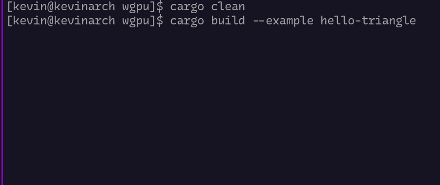

+++
title = "My Year With Rust: The Good, The Bad, The Ugly"
description = "My experience with Rust after a year of using it. The good, but also the bad things."
date = 2022-12-15
draft = false
template="page.html"

[taxonomies]
categories = ["Blog"]
tags = ["Rust"]
[extra]
toc = true
keywords = "Rust, Programming, Clippy, Correctness"
+++

---

 **"A 40 minute read?! I ain't got no time, dood!"** 


I hear you. The actual article contains examples and more details, but [here](#summary) is the summary.


---


## Intro 
One day, when I was reluctantly hacking on a web crawler in the Unity game
engine for some contract work, I turned on some programming stream for some background noise, since
remote work can feel pretty lonely at times.

I picked some random streamer because he was rocking a minimalistic Linux setup using Neovim,
similar to my own. By sheer coincidence, he was just starting his "Teaching Rust to total
Beginners" stream. However, it didn't take long for his enthusiasm for the language and certain features
to distract me from my work.

Everyone knows about the Rust Evangelism Strikeforce. Overly zealous Rust
programmers, who spread the word of their lord and savior to an almost annoying extent. 
This was different. He was enthusiastic about the language, but actually showed the neat little
things the language has to offer, beyond just throwing around keywords I didn't care about.

Who cares about non-saying things like correctness or safety?
It's not like they don't matter, but so far I could manage without them just fine.
It's not like a small wannabe game developer like me really cares so much
about the common buzzwords around Rust. To be completely honest, I am sure there were 
some feelings of spite towards this "cult" that just made me not look into the language further, beyond superficially DuckDuckGoing some sample code and calling it verbose or hideous(I mainly blame lifetimes for that). I feel like you only really start to appreciate these keywords once you experienced them firsthand, at least I did.

Instead, this bearded man talked about enums in combination with pattern matching,
how there is no null and no inheritance, almost everything is an expression, all the countless quality of life features, modern tools, practical macros and functions for iterators and containers.
How error messages are actually readable, but more than that, they are actually helpful!
All that without sacrificing performance.

Sorry, Mr. Webcrawler, you have to wait, I am being converted right now! 

I didn't expect this random streamer to be the impulse that made me procrastinate
for over a year on my personal projects, to learn this supposed to be a "fad" of a programming
language. Thank you [ToggleBit](https://www.twitch.tv/togglebit) for introducing
me to Rust :)


Now, after a little bit over a year of learning, I decided to share my experience and thoughts
about Rust, expressing my love for this language, but also trying to balance it by
talking about its issues. This seemed to be a reasonable entry topic for this
new blog.

Let's start with the good things.


## The Good 
I always feel that reducing Rust to its safety aspect is doing the language a
disservice. While safety might be important for big corporations, a small-time
game developer like me doesn't really care about it. For me, Rust is so much more than just safety.

Here are my favorite things about Rust.

### Rust Does Not Crash
Okay, this is an exaggeration, but it is somewhat true, especially for safe Rust.
The truth is probably closer that Rust gives me a huge amount of confidence.
When it compiles, it generally works.
It won't protect you from all kinds of logic errors, but it prevents a whole class of errors
from happening and turns many into compile time rather than runtime ones.

I admit, when I first started with Rust, correctness was not really a big concern. 
The program should run of course, but crashing or bugs are not the end of the world most
of the time, especially when it comes to games. They just happen.

However, correctness is something that I really started to appreciate after using
Rust for a while. It really grew on me to a point where I don't want to miss it
anymore. 

The strong type system in addition to the ownership and lifetime rules just
get rid of an entire class of runtime errors. There is no null, hidden implicit conversions,
use after free or move, or shared mutable state, at least for the most part.

Errors can often even be recognized almost right after writing a line of code, because they don't pass the compiler.
RustAnalyzer is also doing an amazing job here. This is a huge productivity boost.  
This is by no means unique to Rust and you get something similar in any modern
IDE for most relevant languages. The big difference is that Rust's strict rules,
be it ownership or type safety, just catches a lot more, to a point where it's
rare to not get suspicious when it compiles without any complaints. 


Rust also forces you to handle all code paths. You have to be explicit about things
that can fail. A function doesn't just randomly throw some exception when something goes
wrong. Instead, it returns a `Result` that the caller has to check for errors and
handle them, or it returns an `Option` if there might not be a return value at all.
You just can't accidentally call a function on a "null" object. Part of the type
safety is that null is not a valid state. A value might be optional, but then Rust
forces you to deal with both cases.

Panic exists, but there is always a non-panicking alternative. 
Instead of indexing a slice that might be out of bounds, you can call
`my_slice.get(index)`. Instead of `foo.unwrap()`, you just handle the Result,
etc.

```rust 
if let Some(my_value) = my_slice.get(index) {
    //do something with the value
}

match fallible_function() {
    Ok(my_value) => //do something with the return value,
    Err(error) => //handle the error
}

//or some nice helpers
let output = container.get(index).unwrap_or(default_value);
```
On the first glance this seems more verbose, but in reality, the code to
handle this is something that should be probably written all the time in other languages, often ending up with even more verbosity.
The difference is that Rust forces you to write it, while in other languages,
you often end up procrastinating and might even ignore or forget about the
non-optimal paths. 
Since Rust expects you to deal with these cases, it has quality of life features to
make this easier(like the ?-operator).  

Just to clarify, panicking is not inherently bad. 
Some people might want to crash for severe logic errors in the code right away, to prevent some bigger problems.
My main point is that panicking is opt-in. It's a conscious decision. Not
something that just happens because you forgot to deal with potential errors.
I am certain that this changes how programmers deal with error handling in general. When you have to do
something with the error anyway, be it handling it or just crashing, most will
automatically pick the choice that provides the better experience. 
The side-effect is that the program ends up being more correct, because the potential
error cases are explicit. Nothing just silently fails or
is null.

Even the Rust community itself has a strong sense of correctness and soundness, which
you will notice in third party crates, but also in the tools. Rustacians
actually keep asking for idiomatic solutions to a point where the term
"idiomatic Rust" has almost become a meme, but that is another point.

Then there are the `unsafe` blocks. They stick out like a sore thumb and
automatically attract special attention, especially when something actually goes
wrong. Luckily, they are not throwing all of Rust guarantees out of the window, which
make them still safer than other languages, but this is the world of FFI (calling C code, or code that can expose a C ABI), pointer dereferencing, and messing with mutable static variables among a few other things.
The usual suspects you want to look at when something goes really wrong.
Separating these bad boys from the rest does not only reduce the cognitive
overhead when working inside these blocks, but it makes finding the causes for
issues much easier. They are usually as small as they can be, and often
usually sit inside safe wrappers. 


### Rust is Modern 
After treading through the hell that is CMake or "manually traversing transient dependencies in NuGet to hunt for standard 2.0 versions because of Unity", Cargo, Rust's package manager and build tool, was a change. Turns out, adding dependencies can actually be easy. 

Not just dependency management, but also building for various platforms,
cross compiling from Linux to Windows or even to WebAssembly is straightforward.

But Cargo is not where Rust stops. Documentation, linting, formatting, LSP integration, are
among the best from the languages that I have used so far.

Clippy, Rust's linter, really helps to simplify code, making it more idiomatic, and also educates the user with links that
explain the rationale behind the suggestions. I even opt-in for a stricter set of
warnings, because it is *that* helpful. 

Rust-analyzer, an implementation of the Language Server Protocol, has countless code actions and makes navigation work like a charm. Some really amazing people keep diligently working on it to a point, where I always look forward to the update every Monday. There are far more code actions than one could remember. From inlining functions, to expanding macros or inserting raw JSON - just looking at the options it provides is always a surprise. 

There are many more helpful tools for testing, benchmarking, profiling, an
interpreter that detects undefined behavior([miri](https://github.com/rust-lang/miri)) and much more.
And the best of all, most of them are pretty much the de facto standard in Rust. Not
only do they work really well together, but since most of them essentially come with Rust, or are at least expected to be used, they increase the baseline quality of the code in general. Library maintainers are for example expected to fix at least the default clippy lints.

But it's not just the tools, there are also many quality of life features in the language itself.
So many little handy helpers that you would not even expect from a high level language. 
Helpful macros that can embed bytes directly into the binary(useful for
assets in small games, like game jam entries), formatting strings, things that deal
with boilerplate like derives and the mentioned ?-operator for bubbling up errors.

But my favorite are the iterators. There are just *so* many useful helper
functions that make things easier to read and maintain. For example, to flip an image, that is to make the origin bottom left instead of top
left, is as easy as: 
```rust 
//image_bytes is some container that stores each channel in order, e.g: [r1, g1, b1, a1, r2, g2, b2, a2,..]
image_bytes
    .chunks(4 * image_width)//turn the raw bytes into rows
    .rev()                  //reverses the order of the rows
    .flatten()              //turns the rows back into raw bytes
```

And this comes without additional costs. "Zero cost abstractions" often
sounds misleading, but iterators are generally at least as fast as
manually writing for-loops. `flatten()` and its friends are probably my
favorite, turning nested "arrays" into a single flat one.

So, when I am not sure how I want to do something, I skim through the
[Iterator docs](https://doc.rust-lang.org/std/iter/trait.Iterator.html) and almost always find some new useful little helper. The same is true for containers and even basic types.

The actual useful error messages and lack of legacy luggage(for now) are the cherry on
top.


### Rust Supports My Laziness
I am lazy, but I would argue this is true for most programmers. 
Code would be much safer and easier to maintain if everyone
would be const correct, pay attention to the critical sections, write tests, 
wouldn't go for low effort hacks, properly handle errors and would actually use proper tools. 
From my experience, programmers in general tend to go the path of least
resistance. 

Even a super diligent and enthusiastic programmer will get tired. Some after years of bending to unreasonable client requests, like a web crawler in a fricking game engine, while for
others the lunch break is enough to reach their breaking point. 

This is why defaults are impactful.

"More work to do the better thing" often just turns into
procrastination. "I do it once I am done", but then often just forgotten or a seemingly more important thing,
needs to be done first. It's not just shared mutable state, but also unsafe hacks, or disabling the warnings, that are generally more work in Rust.

Some things that are universally bad are even forbidden. You just can't
have uninitialized values or forget handling the error case.

I hate riding the "Rust good, C++ bad" train. I'm picking on it because it is just the language I'm most
familiar with, not because I dislike it or anything, I like it as much any other C++
programmer who has a love-hate relationship with it. However, having switch cases be
fallthrough, auto generated functions you often want to manually
delete(copy/assignment), non-destructive move, unsafe, mutable variables in general,
or unchecked indexing in arrays, be the default, feels just wrong and often
causes issues.

Heck, it's not even a problem exclusive to C++ or new/intermediate devs, but even experienced
programmers in other languages suffer from bad defaults. A couple months ago, there was a tweet by a C veteran who worked decades for companies like Valve, Oculus and Intel:


The replies mentioned how `-Wimplicit-fallthrough`, would have caught it right
away or depending on the compiler, it might have been part of `-Wall`, `-Wextra`,
etc.(not sharing the rest of this tweet chain, cause the discussion kinda
went south after the suggestions). The point is, that even industry veterans are
sitting there, missing things that should/could have been the default. Wasting
three days on something that not just Rust, but useful defaults in general, would just have prevented.

Why do programmers need to opt-in to `-Wall` and friends in the first place? And why would they even spit
out warnings for system headers? I get that some warnings might be
subjective or report false positives, nothing wrong with those being optional, but an uninitialized value, the classic
`if (a = b) {}`, wrong format character in printf, or even wrongly formatted inline ifs, are objectively bad.
There is no reason to not check for them by default, at least in debug builds.
Warnings being opt-in just means that the people who care about them will be
flooded with warnings for the code they didn't write and just end up missing the warning they care about.. defeating their whole purpose. Rust goes even a step further and makes you "hardcode" the lints that should be followed on a crate or module level, and opt-in to the exceptions for those lints on a case-by-case basis.  

People who need the objectively "worse", rare or unsafe/unchecked options should actually opt-in to them, rather than making the "better" or safer option more work. Who cares if bounds checking is slower? Most of the time
the single bounds check is insignificant to the overall performance, and in the
cases where it actually becomes a problem, you can opt-in to use the unchecked
alternative, when you actually need it. The bonus point is, that you only have
to be really careful in the few exceptions where you need it.

As mentioned, Rust generally follows the philosophy that the "bad" things are opt-in rather than opt-out, but it goes even a step further and its fundamental design turns
complex solutions into a fight with the borrow checker. Especially when starting
you might think your solution is fine, it was fine in the language you used
before, you know how to program, Rust is wrong.. But after embracing "the style
that pleases the borrow checker" and using Rust's uncommon language features(at
least uncommon when it comes to mainstream languages), I can admit that the borrow
checker is usually right, and the code ends up simpler and cleaner as a result. Turns
out, it's easier to test and refactor when objects are not carrying mutable references
around or are in complex graphs of relationships.

Once I was no longer fighting the borrow checker and saw him more as an adviser than
a hurdle, Rust became bliss.

Rust is opinionated, yes, but having an "enforced" standard with naming
conventions and all, makes sure everyone writes the same code. It's super simple
to read other people's code, because you are already familiar with the common
idioms and naming conventions, and clippy will make sure the code is as simple
and idiomatic as it should be.

---

All in all, I found Rust just incredible fun to write. The combination of
matches and enums, the flexibility of traits, the fact that almost everything is an expression, that
the tools actually got your back, errors are caught early or are even prevented
altogether, and the impactful defaults make Rust just fun and kinda just makes 
you strive for the idiomatic solution. 

However, not everything is great, not even in Rust. There are ugly things and
things that are not strictly good. So let's dive into those.

# The (Potentially) Bad

The following things are not strictly bad. They are either necessary "evils" or highly
subjective. Most of them are even optional.

## Rust Is Opinionated 
While I considered it a good thing above, and I think the net result is
definitely positive, there are some arguably bad parts to Rusts opinions and
depending on personal preferences, they can weight differently.

Compared to a language like C++, which pretty much follows the philosophy "do
whatever you want, I don't care", Rust can feel restrictive.

Things like inheritance, function overloading or even default arguments are not supported by design. 

Inheritance is replaced with composition. One could argue that composition is pretty much superior in all cases, but it generally leads to more boilerplate. 
You often end up forwarding functions to the components, unless you want to(or can) make
them publicly accessible. That said, this is not an issue exclusive to
composition, but also true for tuple structs in general(often used for the [newtype
idiom](https://doc.rust-lang.org/rust-by-example/generics/new_types.html)).
Hopefully, Rust will have some way to flatten fields at some point to increase
the ergonomics. 

Function overloading can be somewhat replaced via trait implementations: 
```rust
mod foo {
    pub trait Foo {
        fn bar(&self);
    }

    impl Foo for str {
        fn bar(&self) {
            println!("I am a str");
        }
    }
    impl Foo for i32 {
        fn bar(&self) {
            println!("I'm not :(");
        }
    }
}

use foo::Foo;

fn main() {
    "fart".bar(); //I am a str
    0_i32.bar(); //I'm not :(

    //this also works
    Foo::bar("foo");
    Foo::bar(&32);
}
```
It works for many cases where the number of arguments is the same and the types
just differ, but it requires importing the trait into scope. More complex cases
require associated types(to have an "arbitrary" number of parameters) and are just
not possible cleanly, without involving some From-hacks and tuples.
The advantage is similar to Rust's alternative to traditional operator
overloading, which also uses traits: Once you understand the purpose of the trait, you know what happens
inside the function. There should be no hidden surprise.
There won't be some street tough who decides that % is a valid
operator to overload for the vector cross product...

Default arguments and even overloading to some extent(especially for "constructors"), can be replaced via the builder pattern or just config structs.

```rust 
struct Window {
//...
}

struct WindowBuilder {
//optional fields..
}

fn main() {
    let window = WindowBuilder::new() 
        .resizeable(false)
        //.. bunch of other settings that differ from the defaults
        //   or are optional
        .create(Dimension::new(1024, 768));  //mandatory fields can be added
                                             //here or in the Builder Constructor

}

```
So far, I haven't missed traditional overloading yet, even though that the lack of them leads to some weird automatically generated bindings, like this
comically humongous chunk of [a fn in web-sys](https://docs.rs/web-sys/latest/web_sys/struct.MouseEvent.html#method.init_mouse_event_with_can_bubble_arg_and_cancelable_arg_and_view_arg_and_detail_arg_and_screen_x_arg_and_screen_y_arg_and_client_x_arg_and_client_y_arg_and_ctrl_key_arg_and_alt_key_arg_and_shift_key_arg_and_meta_key_arg_and_button_arg_and_related_target_arg), which even used to break the formatting on docs.rs(scroll horizontally to take in the beauty in its entirety):  
```rust 
pub fn init_mouse_event_with_can_bubble_arg_and_cancelable_arg_and_view_arg_and_detail_arg_and_screen_x_arg_and_screen_y_arg_and_client_x_arg_and_client_y_arg_and_ctrl_key_arg_and_alt_key_arg_and_shift_key_arg_and_meta_key_arg_and_button_arg_and_related_target_arg(
    &self,
    type_arg: &str,
    can_bubble_arg: bool,
    cancelable_arg: bool,
    view_arg: Option<&Window>,
    detail_arg: i32,
    screen_x_arg: i32,
    screen_y_arg: i32,
    client_x_arg: i32,
    client_y_arg: i32,
    ctrl_key_arg: bool,
    alt_key_arg: bool,
    shift_key_arg: bool,
    meta_key_arg: bool,
    button_arg: i16,
    related_target_arg: Option<&EventTarget>
)
```

There are also strict style, versioning and naming guidelines, API references and more or less
forced tools that tell you about the more "idiomatic" usage. You are free to stray away from the defaults, but be sure to face a huge backlash if you ever interact or share your code with others. 

This is not necessarily a bad thing. Coming from C++, where everyone and their
mom uses their own conventions, subset of the language, and manage their own list of STL-thing to avoid or even re-implement.
From "C with operator overloading" to template metaprogramming, "modern C++ version XX" ,traditional OOP and everything in between, it is actually a welcoming change to see similar code written in all projects. Maybe this is because Rust is still young and there are not many things that people are disagreeing with yet. The biggest debate I have seen so far is about whether to use mod.rs or the new foo.rs when it comes to submodules, "foo".to_string() vs "foo".into() vs "foo".to_owned() vs String::from("foo"), and kebab-case vs snake_case for crate names, which are all pretty harmless in the grand scheme of things.

Some people still have their preferences, like minimizing
dependencies, no-panic-policies, or the reliance on generics, but they rarely affect the structure of the code. The overall code will still look pretty much the same. 

Though, there is also the argument to be made about whether Rust makes the aforementioned "bad" things, like shared mutable state, a bit too cumbersome for cases where you actually need them.

## Rust Is Not Object Oriented
The biggest cultural clash for many is probably the fact that Rust is not
object-oriented. Well, it depends on what you consider object-orientation.
There is no clear definition(and some hoodlums might argue that this lack of
clarity is the main issue with OOP in general), but some people reduce it to
language features like having the concept of "classes", as in bundling data and
behavior(with access modifiers), data inheritance and polymorphism, all of which exist in Rust to some
extent. Structs are basically just classes, inheritance can be replaced with
composition and polymorphism can be archived via enums, generics and trait
objects. So Rust offers object-oriented features from that point of view, and might
be considered object-oriented.

However, if you look at it as actually orienting your code
around objects and applying the GoF design patterns, following object-oriented
design as it is commonly used and taught(having a bunch of "is-a" or "has-as"
relationships, because "it makes sense for the nouns"), it becomes more of a way
to solve problems and organizing code than a set of language features. 
This kind of OOP will cause you a hard time in Rust, no matter where you stand on the OOP debate.

No matter how you label the language or define the programming paradigms, Rust encourages grouping data based on purpose, ownership, lifetimes and the problems you want to solve.

You pass around "references" only when needed with the required mutability, store
indices/ID's into flat containers, and use dedicated context objects, instead of storing direct
references left and right. A reference is often only temporary.

The difference becomes especially clear in graph-like data structures, where the data needs to keep track of some sort of
hierarchy. The ["Learn Rust With Entirely Too Many Linked Lists"](https://rust-unofficial.github.io/too-many-lists/index.html)-book is a great resource for these kinds of problems.

Generally, I found shoving the entire data as a whole in a flat container(like a Vec)
and then keeping track of their relationships via optional indices into that
container to be a great workaround, and I would argue that this even has some advantages
over the classic approach.

The bottom line is, your enjoyment of Rust relies on whether you are willing to adapt and
potentially ditch the way you did things in other languages, which is not necessarily
limited to OOP, but to whatever patterns and paradigms you are familiar with.
Rust **is** different. 


## Chasing Idiomatic Rust 
As mentioned previously, "idiomatic Rust" is a very common phrase,
especially amongst beginners, to a point where it almost is a meme. 
When the language, ecosystem and the surrounding community "share" an opinion,
you might be afraid to just tackle the problem on your own, at least this was(and still is
to some extent) true for me. Instead of just doing something, I waste time
essentially bikeshedding, or researching "idiomatic" solutions. What should be
exported in the lib.rs, what should be reachable via the submodules? foo/mod.rs vs
foo.rs as sibling of foo/? A single huge trait vs multiple smaller ones(that add
the noise of having to almost always import them all together)? How to organize assets in the repo for
examples and tests? Should crates in a workspace share a common prefix? Which
Clippy lints can I ignore?(especially when it comes to number casting and
"stuttering" like texture::Data vs texture::TextureData, where the former is
an import nuisance).

Rust is the first language that actually makes me search for the "idiomatic
truth" when being unsure, before I start to think about pros/cons on my own.
While in other languages, it didn't really matter to me, since everyone
had their own guidelines.

Sure, I wasted a lot of time searching the forums, API guidelines and asking
questions(the community is incredibly helpful and seemingly loves to talk about
best practices), but the Result is that this definitely increased the base
quality(at least in my code), but more importantly, reading, interacting with and using other people's code becomes pretty straight forward. There are far fewer inconsistencies.


## Dependency Hell
Without a doubt, adding dependencies to a Rust project is as simple as writing
the name and version(or wild card) in your Cargo.toml. No need to resort to
headers-only libraries, copying the source files into your project,
writing/looking for CMake files(or FindPackage), or building
a separate project to build the binaries for an "old" version, so you don't have to crawl through
NuGet manually to grab dependencies, because the game engine you are using
forked the runtime which only supports .net standard 2.0 dependencies...

A simple, unified dependency manager and build tool, that actually solves most problems, is definitely great, but also comes with some
caveats.

Some might argue that this causes an over reliance on dependencies in the
community. A fairly low level graphics program using winit + wgpu can end up with 100-200 transient
dependencies. This is just from running the hello-triangle example:



It's basically impossible to audit them all. There could be
malicious code or just incompatible licenses in any of them and you need to
trust that everyone in this chain at least vetted their direct
dependencies. There are some movements and tools for "trusted" dependencies,
like [cargo vet](https://mozilla.github.io/cargo-vet/index.html) and general
dependency validation(licenses, sources..) via [cargo-deny](https://embarkstudios.github.io/cargo-deny/index.html), but the
situation is far from ideal. It's not close to npm-kinda-bad at least.
Though, it's not like C++ is super transparent either, since dependencies often rely on system libraries and
packages that are not immediately clear. Or things are commonly
re-written from scratch, so you end up with a dozen different
String-reimplementations or something in a single project.

Another issue is that the community itself tends to recommend existing crates
to answer questions. "How to do X?" "Here is crate Y". While the intention might
be "here is a crate that does what you want, you can take a look and see how they did it",
the result seems to be that the crates are just taken as they are and added as dependency. 

There is nothing wrong with using dependencies per se. They are often tested,
maintained by multiple people and can solve many problems in a timely manner.
Rust also goes a long way to solve many problems with additive features(and
unification) and version compatibility to reduce them as much as it can.
However, aside from the mentioned risks, dependencies are also not without a cost and are often the main reason for
one the biggest complaint that Rust gets: They increase the build times.

The error handling crate
[thiserror](https://docs.rs/thiserror/latest/thiserror/) is the perfect example.
It's an incredibly handy crate and basically the de facto standard for writing 
errors in libraries. And one of the crates(together with `anyhow`) recommended to beginners whenever
they ask about errors. But its dependency on proc-macro can add a few seconds to
the compile times(3-5 on my machine), just to save a few lines of boilerplate.

Basically to write this: 
```rust
#[derive(Error, Debug)]
pub enum GraphicsError {
    #[error("failed to create context: {0}")]
    FailedToCreateContext(String),
    #[error("shader compilation failed { message }")]
    ShaderCompilation {
        message: String,
    },
    #[error("unknown error")]
    Unknown,
}
```

instead of this: 

```rust 
//disclaimer, this is just to illustrate the example,
//the actual content is not important

struct ShaderCompilation {
    message: String,
}

#[derive(Debug)]
pub enum GraphicsError {
    FailedToCreateContext(String),
    ShaderCompilation(ShaderCompilation),
    Unknown,
}

impl std::error::Error for GraphicsError {}

impl Display for GraphicsError {
    fn fmt(&self, f: &mut std::fmt::Formatter<'_>) -> std::fmt::Result {
        match self {
            Self::FailedToCreateContext(cause) => write!(f, "failed to create
            context: {cause}"), 
            Self::ShaderCompilation { comp } => write!(f, "shader compilation
            failed {}", comp.message),
            Self::Unknown => write!(f, "unknown error"),

        }
    }
}

```

Is the `thiserror` solution much cleaner? Without a doubt, and this doesn't even touch
its other useful features, especially all the different conversions it can
generate automatically, which would result in much more boilerplate. Is it worth up to 5 seconds clean compile time? This is highly subjective, and especially for smaller crates I would argue no.

Don't get me wrong, I'm not saying to avoid crates or `thiserror` in
general. If you already rely on proc-macro, `thiserror` is basically free. It
also doesn't really impact incremental build time nearly as much, and there are a bunch of
helpful features(automatically creating From conversions) that makes it more
usable in bigger projects. I just wanted to illustrate the not so obvious cost of crates, that often offer
only marginal comfort.

It might just be a few more seconds, but I found that each extra second adds
another second where I might get potentially distracted(who just sits there waiting for the
build to finish?), often losing track of what I was doing.

Another cost when it comes to dependencies is the size. Rust's binaries
are notoriously bloated unless you strip them, especially the debug ones. It doesn't
help that cargo caches aggressively, and you often end up with artifacts from
previous versions. [cargo prune](https://lib.rs/crates/cargo-prune) and [cargo sweep](https://lib.rs/crates/cargo-sweep) are helpful tools to solve this issue, but my local workspace is multiple GB in size, despite the final bin being just a couple
MB. 

That said, one huge advantage of Rust's dependencies are the de facto standard crates. 
Things like [log](https://crates.io/crates/log), and, especially but not exclusively for graphics programming, [raw-window-handle](https://crates.io/crates/raw-window-handle). Small, bridging crates
that allow you to use and swap out whatever implementations you want in the
executable, as long as they are implementing the traits. They add a nice layer of
abstraction without requiring any additional effort.

Not just the bridges, but also `Serde`, `Nom`, `rand` and many
more are widespread, and any relevant crate supports them(where
applicable), often via optional feature-flags. They are like an extended std.

There are also some issue when it comes to name and typosquatting on crates.io,
the main crate repository for dependencies, and the lack of namespaces is also
frustrating(though the [latter](https://github.com/rust-lang/rfcs/pull/3243) is currently being worked on).

Ultimately, you are in charge on how many dependencies you actually want to add. 
Personally, I tend to only add the absolute necessary ones, but I "waste" time
rewriting things from scratch as a result. This pretty much boils down to
personal preferences.


---

So those were some potentially bad things about Rust, or more accurately, "necessary
evils". They are not strictly bad, and are more like a trade-off, especially
since most of them are optional or at the very least highly subjective.

Especially if you can't let go of your previous programming style, Rust could cause a lot of friction.
On the other hand, if you fully embrace the Rust way of doing things, everything will just flow nicely.

Finally, let's go through the ugly things..

# The Ugly
As much as I like Rust, there are unfortunately some really painful things.

## Lack of maturity
As I mentioned before, Rust is opinionated, but whether the opinions are right or wrong
is only something that time will tell. It is unlikely, but possible that the unified community
might be split because of a difference in opinions at some point, splitting the ecosystem as certain other language did.
It is also unknown whether Rusts runs into its own kind of dependency hell, or if core design decisions
might get in the way in projects built over a long period of time.
There is simply no history of gigantic software using Rust for a decade.

The lack of mature libraries is also a common complaint. Many crates just seem to be afraid
of hitting the 1.0 milestone. There are many breaking changes and everything
seems to be constantly changing. There is a lot of work in progress, but very
few crates that are actually production ready. Rust **is** fairly new.

Another issue caused by Rust's novelty is that there is a lack of jobs. I like
Rust, I want to work with Rust, but comparing the list of jobs with something like C++ is still disappointing, especially after filtering out scam-tech. Let alone when you want to work in a certain niche(game development) and/or work fully remotely.

Time will solve this issue, especially since Rust has proven that it is here to stay. A
little over a year ago, it looked far more uncertain, but with Rust having
its roots now into many big tech companies, the Linux kernel and many drivers
being re-written in Rust, it won't just
fizzle out in a couple of years, so I expect(and hope) the job situation will work itself
out. Unfortunately, right now it's still a desert.

The language itself also has some holes. Rust offers many useful features with its 
lifetimes, traits, and it's typesystem, but I am constantly hitting unstable
features or outright forbidden operations when trying to use them together in
certain contexts. GATs(generics on associated types) are now stable and were one of the things where you just wanted to try to use the existing language tools when you ran into a certain problem, only to be rejected by the compiler.

Or you want to make a function constant(so it can be executed during compile time), only to be greeted by "requires feature const_fn_floating_point_arithmetic".

Then you see some neat little iterator function in the docs, something like
[as_chunks](https://doc.rust-lang.org/std/primitive.slice.html#method.as_chunks) or ways to get a slice from an iterator,
only to get a warning that it is an experimental feature.

Some useful features are also missing. Be it generic specialization, proper
custom allocator support that goes beyond changing the global one(there is WIP
though on the std collections), there doesn't
seem to be something like placement new(there used to be a feature, but it seems to be
abandoned for the new [placement by return
RFC](https://github.com/PoignardAzur/placement-by-return/blob/placement-by-return/text/0000-placement-by-return.md)). 
Static asserts(without some weird hacks), and variadic templates are also on my
wishlist.

As mentioned before, Rust focuses on correctness. There are many tracking
issues that seem to be stuck for years, because there is no agreement on a solution, or
because it wouldn't work on some exotic platforms or due to a niche reason. It's
quickly adding new features that people can agree on, but the difficult
questions seem to be stuck at times, with only an occasional bump being a lost
soul, asking for the current status. There are only so many skilled volunteers
after all, who can only work on so many things. That said, I definitely prefer this approach any
day over rushing half-finished or faulty additions. So a little shout out to all
the amazing volunteers out there, who made Rust what it is!   

## The Borrow Checker Is Not Always Right
Another problem is, that things that should be possible in theory are not passing the borrow
checker.

This is not to be confused with "fighting the borrow checker" to please its
strict requirements, but more about the borrow checker actually being wrong or
being unable to process the information.

Most commonly it's something like a "getter", that keeps borrowing the
owning struct. While fields borrow the struct only partially, functions will
borrow the entire struct for the duration of the returned borrow.

```rust 
struct MegaStruct {
    pub a: String,
    pub b: String,
}

impl MegaStruct {
    fn get_a(&mut self) -> &mut String {
        &mut self.a
    }
    fn get_b(&mut self) -> &mut String {
        &mut self.b
    }
}

fn main() {
    let mut foo = MegaStruct {
        a: "fart".to_string(),
        b: "foo".to_string(),
    };

    //doesn't work
    //let a = foo.get_a();  //a keeps borrowing foo
    //let b = foo.get_b();  //b can't borrow foo anymore

    //println!("{a} {b}"); // E: cant borrow foo as mutable more than once at a time

    //this does work, because it only borrows foo partially
    let a = &mut foo.a;     //borrows only the field a in foo
    let b = &mut foo.b;     //borrows only the field b in foo
    println!("{a} {b}");
}
```
Read the next point for two workarounds for this particular issue :)


Actually, this "limitation" makes total sense. Rust is explicit where it matters
and there is no way to express the partial borrow with the function signature. 
It's unreasonable to expect programmers to peek inside the fn implementation
just to confirm whether a partial borrow happens or not :)  
<br>
Thanks [/u/llogiq](https://www.reddit.com/user/llogiq/), for pointing this out!  
[See also](https://www.reddit.com/r/rust/comments/zmo8dv/my_first_year_with_rust_the_good_the_bad_the_ugly/j0c3te7/?context=3)



Another common scenario are matches(and other diverging code paths) inside a function: 

```rust 
struct MegaStruct {
    pub data: Vec<String>,
}

impl MegaStruct {
    fn get_or_insert(&mut self, index: usize) -> &String {
        match self.data.get(index) {  //E: immutable borrow occurs here
            Some(value) => value,    //E: returning this value requires self.data for '1
            None => {
                self.data.push("new value".to_string());  //E: mutable borrow occurs here
                &self.data[self.data.len()-1]
            }
        }
        //Note: unreachable!(); here, or an "is_some()" check at the start
        //are hacks around this particular issue
    }
}
```
The immutable borrow of the field could in theory be released for None 
branch, because it's not used inside of it, but instead re-borrows the field as 
mutable. However, the complainer, as it is right now, sees the borrow for the entirety
of the match.

There is work in progress to lift the
limitations([Polonius](https://rust-lang.github.io/polonius/what_is_polonius.html)), and the borrow checker will become smarter with time, but it can be a nuisance.

## Rewrite it in Rust 
This is arguably the most frustrating problem in my opinion.

When starting a new project, I find myself trying out different
approaches, just to see how it all works out. Rust often requires rewrites or
changes early, especially during the problem exploration or prototyping phase, which
automatically guides you towards a simple and clean foundation, and it is arguably one of its
strengths, but sometimes you encounter fundamental issues mid-development.

Changes in the requirement, or just new knowledge about the problem space, can potentially break the entire architecture. You might be happy with the solution, and everything is working fine, but then you encounter a case
where everything falls apart. I am sure this is something that just comes with
experience, and I encounter this not nearly as much anymore as I did when I was a few
months into the language, but it can still be a brutal issue. 

Imagine writing a graphics renderer. The graphics resources live on some sort of context
object and you return handles to the caller. You don't want to return a borrow
nor the full ownership, because it makes storing and cleaning them up more of a
hassle. A Handle(for all intents and purposes just an ID) is good enough and there is no ownership involved.
When you want to actually change the resource, you call some sort of getter, to temporarily borrow the
concrete resource, apply the changes, then release the borrow again. 

```rust 
//A shader is basically just a program living and running on the GPU
let fancy_shader: Handle<Shader> = context.create_shader(fancy_source);

if let Some(shader) = context.get_shader_mut(fancy_shader) {
    shader.set_variable("color", Color::RED);
}
```
All working fine. 
Then you work through the implementation, adding meshes, render 3D objects, got
some fancy camera action going,
etc. ..but then you encounter a case where you need to deal with cross-resource
references: 

```rust 
if let Some(shader) = context.get_shader_mut(fancy_shader) {
    //BOOM: can't borrow as immutable because context is already borrowed as mutable
    if let Some(texture) = context.get_texture(amazing_texture) {  
        shader.set_texture("texture", texture);
    }
}
```

There seems to be no way to get a reference to the texture and pass it to the
shader. In theory, it would be possible to use `context.textures.get()` and
`context.shaders.get_mut()` for the partial borrow, but unfortunately the whole
context abstracts the ugly side of OpenGL, Vulkan and other graphics
abstractions away, so the only way to "enforce" the fields is through getters in
the context trait(excluding the approach with generic Wrapper and associated types on the Context
trait for brevity). This is basically where we accidentally run into one of the mentioned limitations, but it
could be any other issue.

Maybe it is possible to pass the texture handle to the shader instead? 
Nope, the shader can't turn the handle into a concrete texture without the
context. This might sound like a case for good ol' `Rc<RefCell>`, but it would require a complete rewrite, potentially even abandoning the Handles in the first place. 

Another way could be to expose this function on the context itself, instead of getting the
resources one by one, we write an unified function on the context that returns
both at once, or just forwards the intended operation:   

```rust 
impl Context {
    // return both as a single tuple
    pub fn get_shader_mut_and_texture(
        &mut self,
        shader_handle: Handle<Shader>,
        texture_handle: Handle<Texture>,
    ) -> (Option<&mut Shader>, Option<&Texture>) {
        (self.shaders.get_mut(shader_handle), self.textures.get(texture_handle)
    }

    //Or: no need to borrow anything for the caller. Just forwards the call
    //using the fields directly.
    pub fn set_shader_texture(&mut self, shader_handle: Handle<Shader>, texture_handle: Handle<Texture>) {
        if let Some(shader) = self.shaders.get(shader_handle) {
            shader.set_texture(self.textures.get(texture_handle))
        }
    }

}
```

Great, this fixed the problem.. but now this one little exception sticks out
from the rest. There might be even additional cases in the future, so it's better to
move all the functions to the context right now, just so they are consistent.
After all, it would be a usability nightmare to find `set_variable` in the shader, but `set_texture`
in the context, even though both should just update a value on the shader.

The other alternative, splitting the borrow into a "double getter" works better
for this example, but we could face an explosion of combinations with varying
mutability and different fields.   

This example is still fairly simple, and should be recognized early in development, but imagine a breaking issue like this potentially being layers deep, involving lifetimes and being in later stages in a project.. 

All it takes is an oversight or a sudden change in requirements that could blow
up the existing solution. The borrow checker is not wrong in this case, but it
still gets in the way.  

"Rewrite it in Rust" from a whole different perspective.
To be fair, this is true in programming in general, but Rust is stricter and
more opinionated, so that easy hacks and workarounds are much, much, more work
and sometimes impossible.

Not just the restrictions, but also the explicitness can sieve through layers of
code. Maybe your struct needs to be annotated with a lifetime now, which then in
turns goes all the way to the root of your program, touching multiple struct and
function on the way.

Sync, object safety and async are all feeble and viral as well. They spread
through your layers, but can break from one moment to another.
You start using the compiler errors as a todo list, working towards the solution, always getting new
errors while you work through the layers, just to arrive at the final error in
your core trait, only to realize that it lost its object safety and can't be made
into a trait object anymore.

Perhaps there are some performance targets that can't be reached or platform limitations with
the current approach that would require changes, which then just snowball through the modules.

As I mentioned, I am sure that experience will help alleviate this issue,
and good coding practices minimize the impact, ideally just limiting it
to the affected modules, but there are always some unknown unknowns in a project.
The current solution might work fine on the current backend with OpenGL, but what about Vulkan? On a different platform like Wasm or the Nintendo Switch? Or just some fancy rendering technique in a game? Possibly just an
oversight in general, since we are just humans? In the worst case, it would require a new solution from scratch.

Some may argue that this kind of strictness leads to overall cleaner code that
is easier to maintain, I wouldn't disagree with that, but no one would want to rewrite large portions of their code, let alone close to release.. But also, how is the experience on a bigger scale?
Or with something where the entire project is an iterative process,
like it is in game development, where features constantly change? Rust just
forces you to deal with the unknown unknowns at seemingly arbitrary times and
could potentially throw you a wrench into your plans at any day.

It's not just the borrow checker, but also potential soundness issues,
like aliasing. One example of this, is the popular Macroquad crate where their
ergonomic intention, a static mutable context, [is unsound and would require a
rewrite to fix](https://github.com/not-fl3/macroquad/issues/333).

The silver lining is that I found Rust code incredibly easy to refactor. 
Aside from the fact that Rust leads to a simpler design without complex
dependency graphs, the compiler becomes essentially a todo-list that you just
work through to finish refactoring. That said, I am interested in how this all
looks in practice when I work on some bigger scale projects during my next year,
with more experience.

## Switching To Other Languages Feels Off
I know. This sounds like [/r/rustjerk](https://www.reddit.com/r/rustjerk/) content, feel free to skip over
this part, but my point is not that Rust is superior, but more that it can causes changes in general, at least it did to me. Rust just does so many things differently.

Being conditioned to please the borrow checker will just change how you approach problems and write code in general.
It takes a lot of time to switch from the "ownership and lifetime" model to the
"Oprah handing out mutable references"-style. The cost of the context switch is
huge.

As stated multiple times now, Rust is opinionated. It is nigh impossible to
internalize these opinions, move to a different language and not keep practicing them. Rust also learned from the mistakes of its predecessors and added a lot of modern fluff, which you don't want to miss anymore.

Correctness alone is something that might sound bland on paper, but once
experienced it, it's something you don't really want to program without. Random segfaults or exceptions
are a test of patience. Dealing with the silly defaults and different programming style/conventions is just tedious.
It's soul crushing to see a perfect fit for some iterator-fu or simple enum matching, but then having to rely on doing it
manually in a more verbose and error-prone way, or run into errors where the
compiler would have had your back.

It takes away a lot of the fun when you suddenly have to switch to another language. 
But it's not just about fun, but also the cost you pay for context switching. Going back
from/to Rust always took me a while to get used to it to hit my usual
productivity levels. This wasn't nearly as much of a problem when I was switching between C++ and C#.

This was a hurdle since I was/am relying on contract work, though now I am trying to work solely in Rust, so I might avoid this issue in the future.

--- 

# Conclusion 

All in all, even after weighing the cons, Rust just ticks the right boxes for me, and I am looking forward to where
my journey will take me. I just don't see myself writing code in another language in the
foreseeable future. 

Thank you for reading. If you are interested in more, check out my [devlog](/devlog), where I am building a commercial game in Rust from scratch, sharing my thoughts and progress along the way. As of the release of this article, I just started and I am currently writing abstractions around OpenGL for the renderer, so feel free to take a look :)  

---

# Addendum 

- [/u/ssokolow](https://www.reddit.com/r/rust/comments/zmo8dv/my_first_year_with_rust_the_good_the_bad_the_ugly/j0dcajz/?context=3) gives many interesting links and details to some of the
    mentioned points in this article. I highly recommend checking it out!


# Summary 

   **Intro**  
   Some bearded man on an internet streaming platform talked about the nice
   things that Rust offered, that went beyond for me irrelevant buzzwords like "safety" or
   "correctness". While I started to really appreciate them after using
   Rust for a while, enums with pattern matching, iterator-fu, the lack of null, the amazing tools and tons of quality of life features are what actually convinced me to take a closer look into the language. As a result, I pushed my plans of taking a year off work to make video games back for a bit over a year to learn this language.
\
\
   **The Good**  
   &#9642; **Rust Does Not Crash**: Rust encourages correctness and the
    community embraces it. Praise for the strong type system and uniform error
    handling!  
   &#9642; **Rust Is Modern**: The tools are amazing and actually got your back. Lots of quality of life features in the language itself.  
   &#9642; **Rust Supports My Laziness**: Impactful defaults and having the "bad" things being opt-in rather than opt-out are a huge game changer. When you are fighting the borrow checker, your solution is usually not as clean and simple as it could be.  
\
   **The (potentially) Bad**  
   &#9642; **Rust Is Opinionated**:  Rust can feel restrictive at times. The alternative
   to common features in other languages often leads to more boilerplate. The plus side is
   that everyone follows the guideline and tries to write (the same) idiomatic Rust.  
   &#9642; **Rust Is Not Object Oriented**: Your enjoyment of Rust relies on
   whether you are willing to adapt and potentially ditch the way you did things
   in other languages, which is not just limited to OOP. Rust **is** different.  
   &#9642; **Chasing Idiomatic Rust**:  I notice how I waste(d) a lot of time
   chasing the idiomatic truth. When a language is opinionated like Rust, you
   don't want to be the odd one out.    
   &#9642; **Dependency Hell**: It's not uncommon to end up with hundreds of transient dependencies. This increases build times and risks, but there is also something like an extended standard library.    
\
   **The Ugly**  
   &#9642; **Lack Of Maturity**:  Lack of jobs and mature libraries. Also still many
   unstable and unfinished language features.   
   &#9642; **The Borrow Checker Is Not Always Right**:  The borrow checker is
   not infallible. There are some limitations that you need to hack around.  
   &#9642; **Rewrite It In Rust**: All it takes is a specific requirement 
   or an unknown to break the entire architecture out of the blue. Trait objects, Sync, lifetimes,
   and async are all viral and/or feeble.    
   &#9642; **Switching To Other Languages Feels Off**:  The borrow checker
   conditions you to write code in a specific way. Once you have embraced Rust's focus
   on correctness and got used to the fact that the tools got your back, you don't want to miss them anymore.

