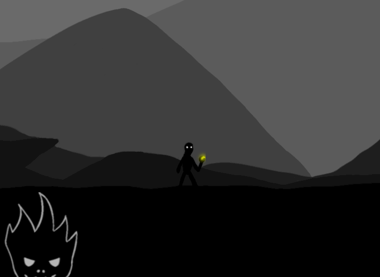
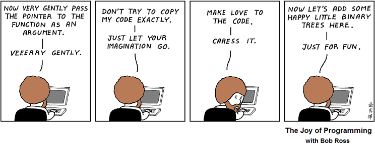

+++
title = "My Motivation"
description = "Why I am doing what I do."
date = 2022-12-10
draft = false
template="page.html"

[taxonomies]
categories = ["Devlog"]
tags = ["GameDev"]
[extra]
toc = false
keywords = "Motivation, Game Development, GameDev, Unity, Custom Engine"
+++

## History Time

XNA was a popular game development environment made by Microsoft,
used to make games like Terraria, Bastion, Fez, Magicka, Stardew Valley and
many more. It was probably the main tool used by aspiring indie game developers
back then.
However, it was announced to be discontinued almost exactly 10 years ago.  

As one of the many wannabe game developers, I was looking for alternatives. To
avoid wasting time on some proprietary technology again, I spent some time
learning C++ and dove into OpenGL and Direct3D. 

I had a blast and finished some tiny game jam entries.

My productivity tanked, but I had fun.

However, I thought playing around wouldn't bring me closer to my goals of making
my own commercial games, so I switched to this new rising engine that most XNA
refugees I knew were using. The Unity game engine. It was(and probably still is)
the king of prototyping and cross-platform support. Working with it was blazingly fast.
It locked some advanced features behind a paywall, but I thought I should stick with it to get paid
doing what I love. Their pricing changed shortly after, making the entire engine
essentially free(except for the dark mode..), and their new improved 2D workflow cemented my
decision.

## Chasing the fun
Even though it worked out, I was getting paid doing full-time freelance game dev work, something was missing. 
That Unity was kinda on a decline didn't help. I don't want to go into details,
or bash the engine, it is still a perfectly valid choice and probably the best
one for productivity and jobs.
However, adding many(unfinished) features, some of which that split the ecosystem, made working with it a drag.
Things that used to be pretty much instantaneous, like opening a project or entering play
mode, started to take a while. WebGL builds as well seemed to be broken every other Linux release.
Having a launcher that occasionally ships malware and takes
more resources than the whole engine 10 years ago are the straw that broke the
camel's back. Stuff like that just took away the fun for me.

Meanwhile I had some toy projects to distract me from the accumulating
frustrations I had with Unity.  

Nothing fancy, just a little renderer in C++ and now modern OpenGL.

<video autostart="false" controls="true" width="100%" />
<source src="day0.mp4" type="video/mp4">
(Sorry, here should have been a cute little video. Looks like it's not supported
in your Browserino. Sad.)
</video>

*(Did I mention that I am a weeb?)*  

<video autostart="false" controls="true" width="100%" />
<source src="day2.mp4" type="video/mp4">
(Sorry, here should have been a cute little video. Looks like it's not supported
in your Browserino. Sad.)
</video>

I had fun! 

I decided to save up some money to take a year off work, doing the
cowards version of "quitting your job to follow your dreams": The version where you are still
available for previous clients or referrals, but are just not actively looking for new ones.

Ideally, I would finish some tiny games in my custom engine and hope to reach
ramen-profitability(enough to pay my living expenses).
If not, I could always go back doing Webcrawlers in Unity(and other
similar fun sounding stuff..). But at least I gave it a shot.

I could have made up countless of arguments for being in control, moral reasons,
learning experience, or just preservation, but ultimately, going with a custom engine just boils down to fun for me.
Using the language and tools I like, with my preferred workflow and actually understanding the interesting little details, sounds like bliss.  

  
*(source: [http://abstrusegoose.com/467](http://abstrusegoose.com/467))*

As it happened, my journey got slightly delayed after listening to some random
bearded man who converted me to the church of [Rust](/blog/my-year-with-rust) on
some online streaming platform.

Even though my endeavor got pushed back by a whole year, hyper-inflation is imminent, writing a custom engine and open sourcing the games are not the best preconditions for a sustainable "business", I am finally going to take the jump. 

This devlog is just me logging my journey.
