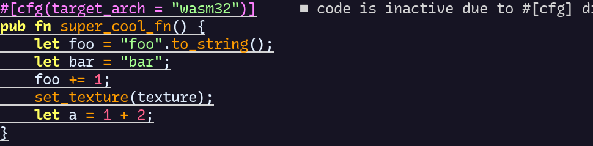
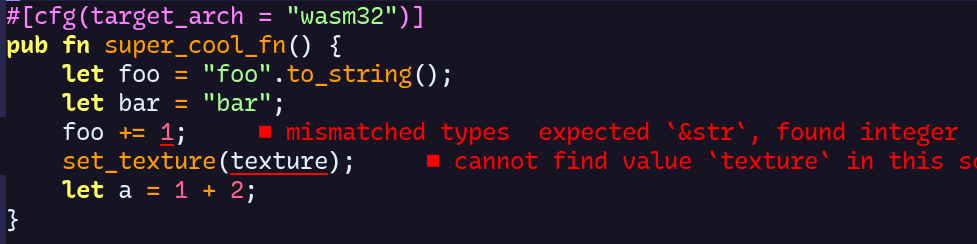

+++
title = "Project Setup"
paginate_by = 1
sort_by = "weight"
weight = 1
transparent = true
insert_anchor_links="heading"
template = "book.html"

[extra]
toc = true
+++

The first thing to do is obviously setting up the project. 
Let's start with my personal global settings.

## Personal Settings

Inside my project directory, but outside the actual workspaces and projects, I have a `.cargo/config.toml` for "global" configurations on my machine.


Things like the linker(I'm using [mold](https://github.com/rui314/mold)), but
also the current build target. 

I found that mold helps with link times, but
your mileage may vary. However, specifying the target is a one stone two
birds kinda thing. It makes my editor less annoying when trying to write code
for another platform, because it's marked as inactive otherwise. Not only is is
more noise, but it also disables the inline errors.

Basically, turning this: 



Into This:


I'm using Neovim and its LSP with RustAnalyzer, so no clue if other setups run into similar problems.

There might be other ways, but the other benefit is to work around a specific [cargo issue](https://github.com/rust-lang/cargo/issues/9239), that
would force a full rebuild of the dependencies when building for different
platforms, when rust flags are involved(e.g. when using the mold linker above).
Having this config outside of the actual project workspaces makes sure that I don't pollute the actual repositories
with personal settings. Cargo crawls through the current and parent directories(and its own home) and considers all [configs](https://doc.rust-lang.org/cargo/reference/config.html) for the build. 

Another benefit is that it makes calls to run, check, etc. use the specified
target by default. It's still possible to pass the --target argument to cargo,
but most of the time I tend to stick with a specific target for a while before
moving on, so this switch is just more comfortable.

So my personal config file outside the actual projects looks like this:



```toml
[build]
#see https://github.com/rust-lang/cargo/issues/9239#issuecomment-792600349
#just comment in the "current" target
#target = "x86_64-unknown-linux-gnu"  #own machine 
target = "wasm32-unknown-unknown"

#I'm using Arch btw
[target.x86_64-unknown-linux-gnu]
linker = "clang"
rustflags = ["-C", "link-arg=-fuse-ld=/usr/bin/mold"]
```



## Creating The Workspace

After coming up with a cool name, the next step is to actually create the
workspace for all the renderer/graphics crates. 
Splitting the renderer into a multiple crates will help with the incremental
build times later.

```bash
#cac for cacatuidae, the family of the magnificient cockatiels, and cockatoos
cargo new --lib cac_graphics
```

There is no new --workspace in cargo yet, but --lib makes sure that the
generated .gitignore adds the [Cargo.lock
file](https://doc.rust-lang.org/cargo/faq.html#why-do-binaries-have-cargolock-in-version-control-but-not-libraries). Then I removed the src directory, and replaced the content of the Cargo.toml with a workspace definition.
One thing I also always do when dealing with heavy IO(like game assets), is to add an opt-level for debug builds(dev profile). It doesn't really affect build times, but without it, a large gltf-scene can take minutes instead of seconds to load. I found out about it when I played around with bevy, thanks to [the incredible unofficial cheat book](https://bevy-cheatbook.github.io/pitfalls/performance.html#why-is-this-necessary). I pretty much end up enabling optimizations to some extend in all game related projects at some point, where I am almost considering adding it to my personal .cargo/config.

So for now, my workspace only contains the directory .git, a .gitignore and the
Cargo.toml with the content: 


```toml
[workspace]
members = [] 

# To avoid unbearable long loading times for assets,
# it is required to at least have a minor opt-level
[profile.dev]
opt-level = 1
```



